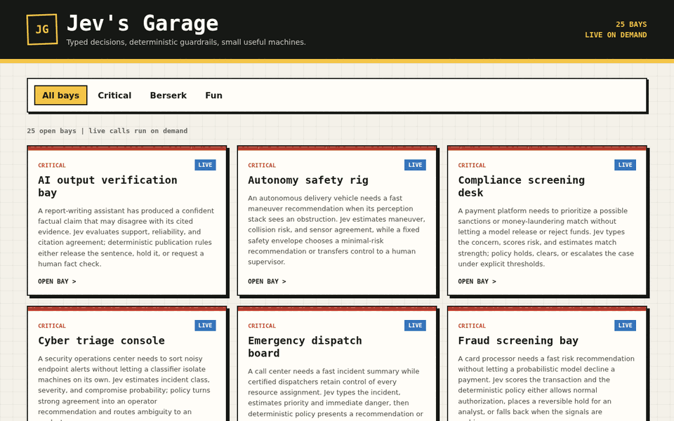
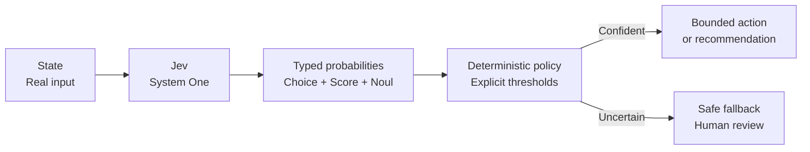

# Jev's Garage

[](https://github.com/JGalego/Jevs-Garage/actions/workflows/ci.yml)
[](https://github.com/JGalego/Jevs-Garage/actions/workflows/live.yml)
[](pyproject.toml)
[](https://docs.astral.sh/uv/)

A workshop full of small, inspectable experiments for [TypeSafe](https://typesafe.ai/) System One models. Each bay gives Jev a realistic state, asks typed questions, and lets ordinary Python policy decide what happens next.



## System One, Briefly

System One turns unstructured or structured state into fast probabilistic judgments. Instead of asking for free-form prose, these demos ask `Choice`, `Score`, and `Noul` questions and receive typed values with uncertainty that application code can reason about.



Jev supplies judgment; the application keeps authority. Critical demos never let the model directly perform an irreversible side effect.

## Open The Garage

You need Python 3.11+, [`uv`](https://docs.astral.sh/uv/), and a TypeSafe API key.

```bash
uv sync --locked --all-groups
cp .env.example .env
# Add your TYPESAFE_API_KEY to .env
just gallery
```

The gallery opens locally with an editable **Run input** JSON document for every bay. It validates JSON syntax, required fields, nested shape, value types, and demo-specific limits before enabling **Run Jev**, then revalidates on the server before the live call. A command bar stays above the scrollable result, streams real stage progress, and colors signals from red through amber to green by certainty. If port `8000` is occupied it tries the next available port; use `just gallery --no-browser --port 8080` to choose explicitly.

## Critical 🔴

Every critical bay follows `state -> Jev -> typed result -> deterministic policy -> action OR safe fallback`.

| Bay | What it demonstrates |
| --- | --- |
| [Fraud screening](critical/fraud-screening/) | Routes suspicious card activity to authorization, verification, or reversible review holds. |
| [Cyber triage](critical/cyber-triage/) | Turns endpoint evidence into an operator-owned investigation or containment recommendation. |
| [Safety guardrails](critical/safety-guardrails/) | Gates drafted assistant output through explicit release, transform, and suppression rules. |
| [Medical routing](critical/medical-routing/) | Provides conservative care routing without diagnosing or contacting services. |
| [Industrial faults](critical/industrial-faults/) | Interprets pump telemetry without sending machinery control commands. |
| [Emergency dispatch](critical/emergency-dispatch/) | Prioritizes call information while certified dispatchers retain resource control. |
| [Autonomous decisions](critical/autonomous-decisions/) | Maps uncertain perception to a certified motion envelope or human takeover. |
| [Infrastructure monitoring](critical/infrastructure-monitoring/) | Recommends runbooks or evidence gathering without mutating production. |
| [Compliance screening](critical/compliance-screening/) | Routes payment concerns without releasing, rejecting, or reporting funds. |
| [AI output verification](critical/ai-output-verification/) | Checks whether cited evidence supports an AI-authored factual claim. |
| [Supply-chain contamination](critical/supply-chain-contamination/) | Recommends release, sampling, or quarantine for a cold-chain anomaly. |
| [Wildfire escalation](critical/wildfire-escalation/) | Assesses spread and exposure while incident command retains public authority. |

## Berserk 🟠

Berserk bays are production-shaped orchestration experiments: multiple live Jev calls, branching or recursive graphs, source provenance, hard budgets, audit trails, and visual output. They remain dry-run advisory systems with no credentials for the actions they recommend.

| Bay | What it demonstrates |
| --- | --- |
| [Global payment incident](berserk/global-payment-incident/) | Two-stage diagnosis and intervention challenge with immutable snapshots and dual approval. |
| [Meta-Jev situation room](berserk/meta-jev-situation-room/) | Four real public feeds fan through specialists, critics, an arbiter, and a stability pass. |
| [Infinity of Jevs](berserk/infinity-of-jevs/) | A bounded recursive council feeds typed outputs back through parallel roles until convergence, cycle, or budget. |

## Fun 🟢

The same typed-decision pattern also works nicely when the stakes are dinner, music, or a three-centimeter pencil.

| Bay | What it demonstrates |
| --- | --- |
| [Snack matchmaker](fun/snack-matchmaker/) | Converts a fuzzy craving into one pantry-aware snack. |
| [Playlist pilot](fun/playlist-pilot/) | Maps a moment to mood, energy, and instrumental preference. |
| [Movie night referee](fun/movie-night-referee/) | Finds group overlap or hands the decision to a ranked vote. |
| [Plant name studio](fun/plant-name-studio/) | Selects a naming style and bounded candidate from a plant's surroundings. |
| [Tabletop sidekick](fun/tabletop-sidekick/) | Fills a party role without adding another spotlight magnet. |
| [Leftover remix](fun/leftover-remix/) | Chooses a practical dish format from fridge odds and ends. |
| [Weekend quest](fun/weekend-quest/) | Turns weather, energy, and time into a small local adventure. |
| [Outfit weather oracle](fun/outfit-weather-oracle/) | Maps forecast and plans to a practical layering recipe. |
| [Photo caption lab](fun/photo-caption-lab/) | Chooses a caption from a fixed tone-aware deck. |
| [Tiny museum curator](fun/tiny-museum-curator/) | Finds an exhibition thread connecting three ordinary objects. |

## Run A Demo

All demo runs call the real TypeSafe API. There is no alternate response path.

```bash
just demo critical/fraud-screening

# Equivalent direct command
uv run python critical/fraud-screening/demo.py
```

Each terminal dashboard shows the input state, typed Jev signals, confidence, policy decision, and responsible owner. The output is a recommendation; critical examples do not execute the represented operational action.

## Tests

The default suite is offline and needs neither an API key nor network access. It verifies SDK question declarations, gallery discovery, and deterministic policy boundaries using plain policy inputs.

```bash
uv run pytest
# or
just test
```

Live contract tests call the TypeSafe API for all 25 demos and validate every returned answer type and probability invariant:

```bash
uv run pytest --live
# or
just test-live

# Narrow a live run when iterating
uv run pytest --live -k fraud_screening
```

The manual **Live Jev** GitHub Actions workflow requires a repository secret named `TYPESAFE_API_KEY`. Pull requests and pushes run only the offline quality gate.

## Workshop Commands

| Command | Job |
| --- | --- |
| `just` | List available jobs. |
| `just setup` | Sync the lockfile and development tools. |
| `just gallery` | Launch the local live-on-demand gallery. |
| `just demo fun/weekend-quest` | Run one demo against Jev. |
| `just test` | Run all offline tests. |
| `just test-live` | Run all real API contract tests. |
| `just check` | Check formatting, lint, types, and offline tests. |
| `just ci` | Reproduce the CI quality gate from a locked environment. |

## Under The Hood

```text
critical/<demo>/
	README.md       problem, Mermaid flow, run command
	demo.py         state, SDK questions, policy, terminal UI
	test_<demo>.py  question contract and deterministic policy boundaries

berserk/<demo>/   staged or recursive Jev graphs, live data, provenance, charts
fun/<demo>/       same tiny, self-contained shape
src/jevs_garage/  shared rendering, operation records, and gallery
tests/test_live.py real API contract coverage for every demo
```

The project uses the official [`typesafe-sdk`](https://github.com/typesafe-ai/typesafe-sdk-python) directly. Shared code is intentionally small; each bay keeps its state, questions, thresholds, and outcomes where they can be read together.
