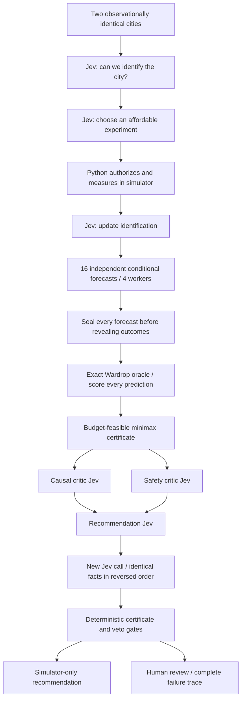

# Counterfactual City / The Road That Should Not Exist

Two cities. Identical traffic. Opposite consequences. Jev buys one experiment, forecasts sixteen alternate futures, then faces an exact traffic oracle, two critics, and an evidence-order challenge. Closing a perfectly good road can make every driver faster. Believing that trick in the wrong city makes every driver slower.

## The reveal

At the default demand of 4,000 trips, both synthetic cities show **80-minute journeys**, with every driver using the shortcut. No amount of rereading that observation identifies the city.

| Intervention | City A | City B |
| --- | --- | --- |
| Keep the shortcut | 80 minutes | 80 minutes |
| Close the shortcut | **65 minutes** | **115 minutes** |
| Double congestible-road capacity | 40 minutes | 40 minutes |

Closing a road saves **15 minutes per driver** in A: **1,000 aggregate driver-hours per modeled demand cohort**, without deleting a single trip. In B, the same closure adds 35 minutes per driver. Capacity upgrades help, but exceed the default intervention budget. The task is not “always remove the road”; it is **discover which world you are in before making a causal recommendation**.

This is Braess's paradox in a deliberately small, inspectable simulator. Traffic is synthetic; **all Jev judgments are real API calls**. There is no replay or canned-answer mode, no public-feed dependency, and no promise that Jev passes. A failed forecast or safe fallback is part of the demonstration, not something to hide.

## The 23-call gauntlet



1. **Admit ignorance:** the first call should return `unresolved`. City labels alone contain no evidence.
2. **Buy information:** repeating the baseline costs zero but reveals nothing. Inspecting an unused outer road costs one; a closure trial costs three. Python blocks unaffordable probes without silently substituting a better one.
3. **Update on a measurement:** the private `hidden_city` selector is excluded from every request. Only the authorized probe result distinguishes it. The selector remains visible to the human operator in the input, so this is not a concealed answer key for the audience.
4. **Commit before seeing answers:** eight interventions across two conditional hypotheses produce sixteen forecasts. Forecasters receive the network equations, not the oracle outputs or other forecasts.
5. **Expose errors:** compare each direction (`faster`, `same`, `slower`) with exact equilibrium. The gallery displays misses, not just confident answers. These correlated, synthetic examples are not a calibration benchmark or proof of general reasoning ability.
6. **Challenge the result:** causal and constraint critics review the candidate. A second recommendation receives the same facts in reverse order and does not see the first recommendation. This checks one order perturbation; it does not establish general robustness or independent expert consensus.
7. **Keep authority in code:** authorization requires uniquely measured identification, matching posterior, positive support, confidence, two approving critics, a correct forecast for the selected intervention, stable recommendation under reordering, and agreement with the deterministic optimum. Otherwise: hold.

## Exact model, explicit limits

The directed network has routes `S-A-T`, `S-B-T`, and, when open, `S-A-B-T`.

- `S-A` and `B-T` each cost `0.01 * edge_flow / capacity` minutes.
- `A-T` and `S-B` each have fixed delay: 45 minutes in A, 95 in B.
- `A-B` has zero delay. Drivers selfishly choose minimum-latency routes.
- Every trip is preserved; equilibrium is static, symmetric, deterministic, and noiseless.

Let demand be $D$, the congestible-edge slope be $a$, and fixed delay be $c$. With the shortcut open, its equilibrium flow is $z = \max(0, \min(D, 2c/a-D))$. Each outer route carries $(D-z)/2$. With it closed, each outer route carries $D/2$ and takes $aD/2+c$ minutes. The solver checks no real map or actual road conditions.

Eight candidates combine open/closed with capacity multipliers 1, 1.25, 1.5, and 2. Costs are abstract units: closure costs 1; upgrades cost 25, 50, and 100, plus 1 if also closing. Python minimizes worst-case latency across surviving hypotheses, then cost, then a stable key. Latency comparisons are rounded to nine decimal places to avoid floating-point noise defeating cost tie-breaking. Insufficient identification still forces review even when a minimax candidate exists.

The exactness claim applies **only to this model**, not to real transport planning. Missing hypotheses, noisy measurements, transient congestion, unequal drivers, and induced demand are out of scope. Real deployment would require substantially different evidence and controls.

## Run and play

```bash
uv run python berserk/counterfactual-city/demo.py
# Or open the gallery and choose Berserk / Counterfactual City
just gallery
```

In the gallery's editable input, try:

| Edit | What it tests |
| --- | --- |
| `hidden_city: "city_b"` | Same initial observation, but closure should no longer win. |
| `probe_budget: 0` | No informative authorized experiment; policy must fall back. |
| `intervention_budget: 0` | Closing is not affordable. |
| `intervention_budget: 100` | Capacity doubling becomes feasible; the “remove a road” story should lose. |
| `demand: 1000` | Closure now hurts even city A; a slogan is not a causal model. |

The default run uses **23 model stage calls**, up to four concurrent workers, and a 30-second SDK timeout per call. Calls are reserved before dispatch. There are no orchestration-level retries or unbounded recursion; SDK transport behavior may have its own retry semantics. API failures abort rather than fabricating answers or issuing partial approval. Expect normal API charges; no universal latency or dollar estimate is asserted.

The gallery automatically discovers this bay. Its four visuals show exact alternate futures, forecast hits/misses, identification certainty before/after the probe, and the model-call graph. Audit events retain input fingerprints, probe authorization and measurement, all forecast outcomes, the certificate, and the final blocked-execution record. Model responses remain inspectable in the Signals tab. No source receipt pretends the simulator is a live public feed.

## Offline verification

```bash
uv run pytest berserk/counterfactual-city tests/test_gallery.py
uv run pytest --live -k counterfactual-city
```

Offline tests use plain policy inputs and recording test doubles, never an alternate runtime model-response path. They cover all three equilibrium regimes, conserved demand, Wardrop conditions, indistinguishable observations, informative/noninformative probes, budget and confidence boundaries, deterministic optimization, hidden-selector isolation, forecast sealing, order-challenge isolation, and call-budget enforcement.