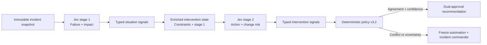

# Global Payment Incident Command

A payment platform is degrading across regions while a release and provider instability overlap, making a single-label diagnosis unsafe. Two Jev stages assess the incident and then challenge the proposed intervention; deterministic policy checks agreement, blast radius, evidence sufficiency, and change risk before producing an approval-gated recommendation.



Production-shaped controls include an idempotency key, immutable state fingerprint, ordered audit events, dual approval, and a dry-run-only client. No rollback, failover, traffic shift, or customer communication is executed by this demo.

```bash
uv run python berserk/global-payment-incident/demo.py
```