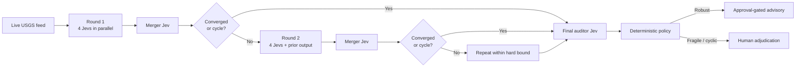

# Infinity of Jevs

A recursive council repeatedly fans one live USGS earthquake feed through hazard, exposure, skeptic, and counterfactual Jevs, then feeds all four typed outputs into a merger Jev. Each merged result becomes evidence for the next round until deterministic code detects convergence, an A-B-A cycle, or the hard round and call budgets; a final auditor Jev challenges whatever survives.



The infinity is conceptual, never literal: defaults permit at most three rounds and sixteen Jev calls. Earlier outputs are marked as probabilistic evidence rather than independent facts, cycles and convergence are detected outside the model, unused rounds appear as skipped in the live tracker, and no external action is available.

```bash
uv run python berserk/infinity-of-jevs/demo.py
```
