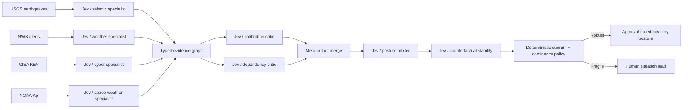

# Meta-Jev Global Situation Room

Four live public-data pipelines fan out concurrently across earthquakes, severe weather, exploited vulnerabilities, and space weather. Their typed Jev outputs become inputs to two critic Jevs, then an arbiter Jev, then a counterfactual stability Jev; deterministic policy merges the whole evidence graph into one advisory posture or a safe fallback.



This is intentionally recursive: Jev outputs are serialized as explicitly probabilistic evidence, criticized by other Jevs, merged, adjudicated, and challenged again. Every source has a URL, retrieval timestamp, source timestamp, record count, and SHA-256 receipt; the gallery renders maps, bars, a line chart, and the pipeline confidence graph.

```bash
uv run python berserk/meta-jev-situation-room/demo.py
```
