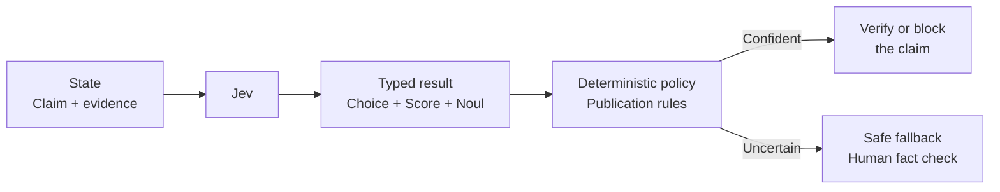

# AI Output Verification

A report-writing assistant has produced a confident factual claim that may disagree with its cited evidence. Jev evaluates support, reliability, and citation agreement; deterministic publication rules either release the sentence, hold it, or request a human fact check.



```bash
uv run python critical/ai-output-verification/demo.py
```