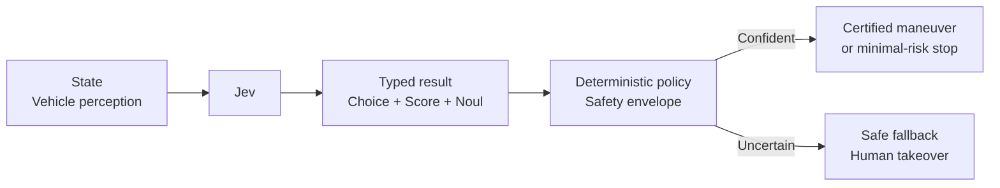

# Autonomous Decisions

An autonomous delivery vehicle needs a fast maneuver recommendation when its perception stack sees an obstruction. Jev estimates maneuver, collision risk, and sensor agreement, while a fixed safety envelope chooses a minimal-risk recommendation or transfers control to a human supervisor.



```bash
uv run python critical/autonomous-decisions/demo.py
uv run python critical/autonomous-decisions/demo.py --scenario uncertain
uv run python critical/autonomous-decisions/demo.py --live
```