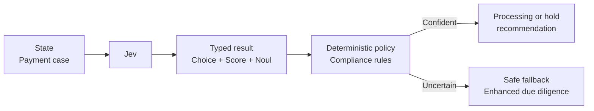

# Compliance Screening

A payment platform needs to prioritize a possible sanctions or money-laundering match without letting a model release or reject funds. Jev types the concern, scores risk, and estimates match strength; policy holds, clears, or escalates the case under explicit thresholds.



```bash
uv run python critical/compliance-screening/demo.py
uv run python critical/compliance-screening/demo.py --scenario uncertain
uv run python critical/compliance-screening/demo.py --live
```