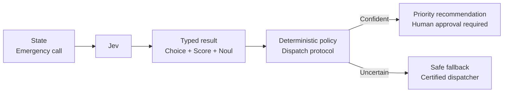

# Emergency Dispatch

A call center needs a fast incident summary while certified dispatchers retain control of every resource assignment. Jev types the incident, estimates priority and immediate danger, then deterministic policy presents a recommendation or keeps the caller with a human when confidence is weak.



```bash
uv run python critical/emergency-dispatch/demo.py
```