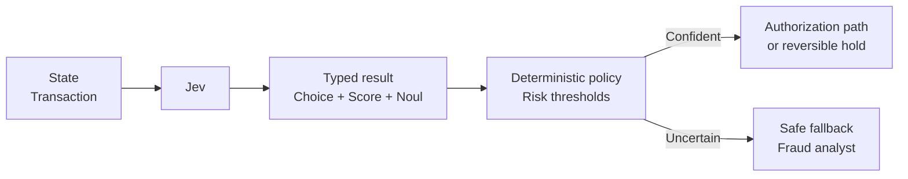

# Fraud Screening

A card processor needs a fast risk recommendation without letting a probabilistic model decline a payment. Jev scores the transaction and the deterministic policy either allows normal authorization, places a reversible hold for an analyst, or falls back when the signals are ambiguous.



```bash
uv run python critical/fraud-screening/demo.py
```