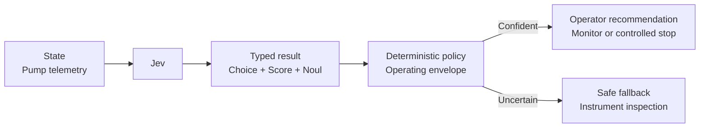

# Industrial Faults

A plant operator needs a rapid interpretation of noisy pump telemetry, but a model must never actuate machinery. Jev identifies a likely fault, scores severity, and estimates unsafe operation; fixed rules produce an operator-facing recommendation or a conservative inspection fallback.



```bash
uv run python critical/industrial-faults/demo.py
```