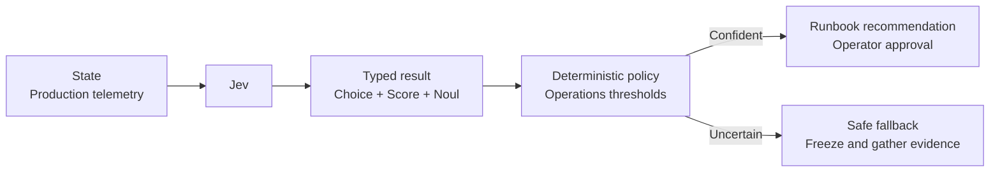

# Infrastructure Monitoring

An on-call engineer needs a fast reading of a noisy production incident without allowing a model to deploy, roll back, or restart anything. Jev classifies the likely failure domain, impact, and outage state; deterministic policy recommends an operator-approved response or gathers more evidence.



```bash
uv run python critical/infrastructure-monitoring/demo.py
```