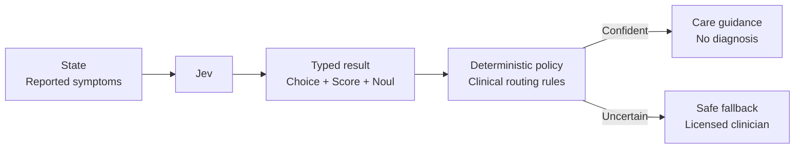

# Medical Routing

A virtual intake desk must route symptoms quickly without pretending to diagnose or replacing a clinician. Jev estimates route, urgency, and red-flag probability; deterministic policy presents conservative guidance or hands uncertain cases to a licensed professional.



```bash
uv run python critical/medical-routing/demo.py
```