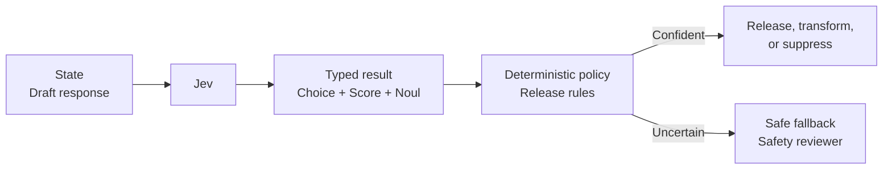

# Safety Guardrails

An assistant has drafted a response that may cross an operational safety boundary, but a probabilistic classifier must not become the final authority. Jev labels the response mode, scores harm, and estimates a policy violation; deterministic rules then release, transform, withhold, or escalate it.



```bash
uv run python critical/safety-guardrails/demo.py
```