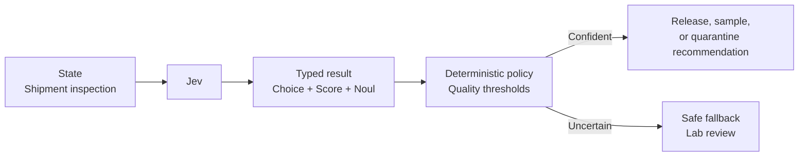

# Supply-Chain Contamination

A cold-chain team needs to assess a food shipment with a temperature excursion and damaged seal without letting a model release or destroy inventory. Jev estimates hazard type, severity, and lot impact; deterministic policy recommends quarantine, release, sampling, or expert review.



```bash
uv run python critical/supply-chain-contamination/demo.py
uv run python critical/supply-chain-contamination/demo.py --scenario uncertain
uv run python critical/supply-chain-contamination/demo.py --live
```