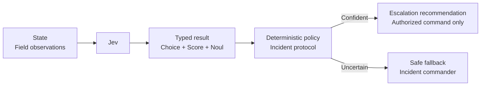

# Wildfire Escalation

An incident team needs to interpret rapidly changing field observations without allowing a model to issue evacuation orders. Jev estimates spread behavior, threat level, and settlement exposure; deterministic policy recommends escalation or routes uncertain evidence to the incident commander.



```bash
uv run python critical/wildfire-escalation/demo.py
uv run python critical/wildfire-escalation/demo.py --scenario uncertain
uv run python critical/wildfire-escalation/demo.py --live
```