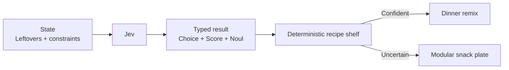

# Leftover Remix

Yesterday's odds and ends can become dinner, but only if the flavors and effort level agree. Jev types the dish direction, ambition, and crispiness preference; a deterministic recipe shelf picks a remix or falls back to a modular snack plate.



```bash
uv run python fun/leftover-remix/demo.py
```