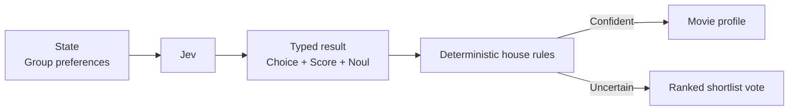

# Movie Night Referee

Four people, six preferences, one remote: movie night is a compact negotiation problem. Jev finds the most compatible genre, intensity, and group-fit signal, then deterministic house rules pick a slot or hand the choice back to a shortlist vote.



```bash
uv run python fun/movie-night-referee/demo.py
```