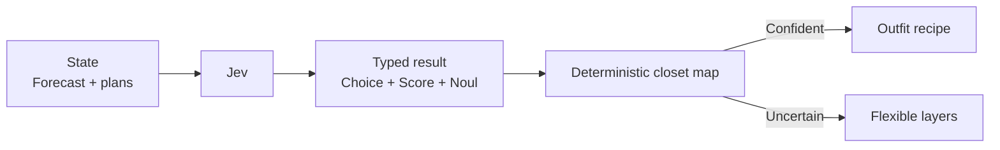

# Outfit Weather Oracle

A forecast says numbers; a person asks whether the yellow jacket is a mistake. Jev types the outfit layer, warmth level, and rain need, then a deterministic closet map returns one practical combination or a flexible layering fallback.



```bash
uv run python fun/outfit-weather-oracle/demo.py
```