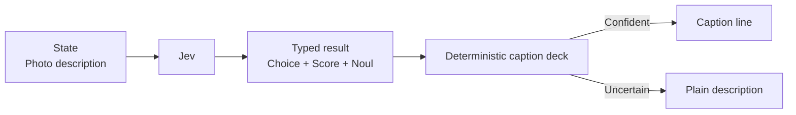

# Photo Caption Lab

A good caption has to match the picture without narrating every pixel. Jev types the voice, playfulness, and pun tolerance, then a deterministic caption deck selects a line or returns a plain descriptive fallback when the tone is uncertain.



```bash
uv run python fun/photo-caption-lab/demo.py
```