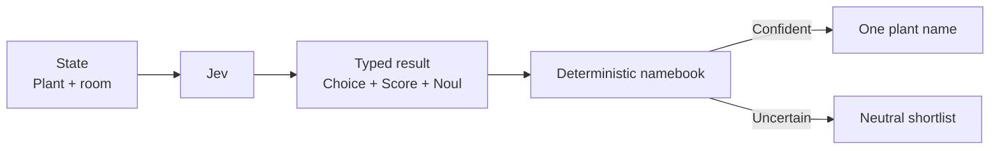

# Plant Name Studio

A new houseplant deserves better than the first pun that wanders past. Jev reads the plant's look and room, picks a naming style and weirdness level, then a tiny deterministic namebook returns one candidate or a neutral shortlist when the signals wobble.



```bash
uv run python fun/plant-name-studio/demo.py
uv run python fun/plant-name-studio/demo.py --scenario uncertain
uv run python fun/plant-name-studio/demo.py --live
```