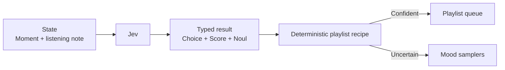

# Playlist Pilot

A commute mood is messy; a playlist switch does not have to be. Jev turns context into mood, energy, and lyric preference, then a fixed set of playlist recipes chooses a queue or offers a mixed sampler when the vibe is unclear.



```bash
uv run python fun/playlist-pilot/demo.py
```