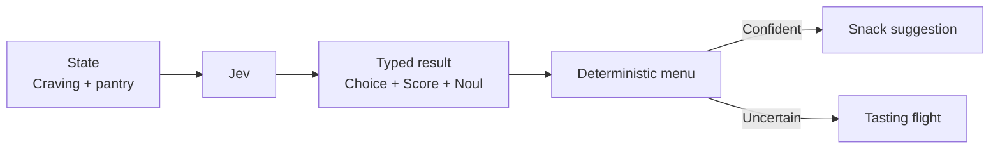

# Snack Matchmaker

Choosing a snack from vague cravings is exactly the sort of tiny, fuzzy decision Jev can make concrete. It types the flavor, adventure level, and appetite for heat, then a deterministic menu maps that result to one snack or an uncertainty sampler.



```bash
uv run python fun/snack-matchmaker/demo.py
```