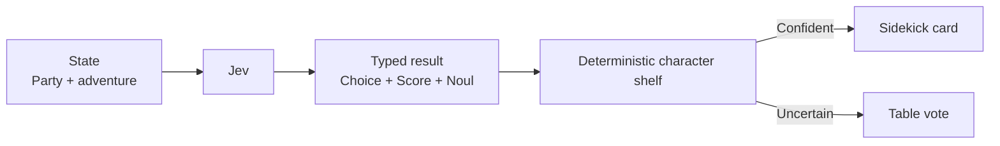

# Tabletop Sidekick

A one-shot party needs a final character who complements the table instead of stealing every scene. Jev types the missing role, chaos level, and team fit, then a deterministic character shelf supplies one sidekick or asks the group to choose when the read is uncertain.



```bash
uv run python fun/tabletop-sidekick/demo.py
uv run python fun/tabletop-sidekick/demo.py --scenario uncertain
uv run python fun/tabletop-sidekick/demo.py --live
```