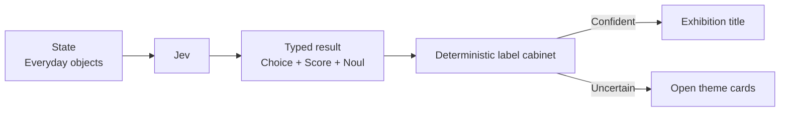

# Tiny Museum Curator

Three ordinary desk objects are enough for a very small exhibition if someone can find the thread. Jev types a curatorial theme, seriousness, and coherence, then a deterministic label cabinet supplies a title or falls back to a choose-your-own-theme display.



```bash
uv run python fun/tiny-museum-curator/demo.py
```