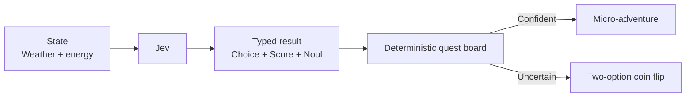

# Weekend Quest

A free Saturday can vanish under too many reasonable options. Jev turns weather, energy, and company into an outing style and commitment level; fixed house rules choose a micro-adventure or present a two-option coin flip when the day refuses to decide.



```bash
uv run python fun/weekend-quest/demo.py
```